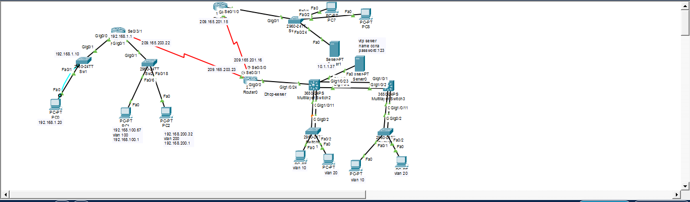

# Cisco CCNA Enterprise Network Lab

Bu repository Cisco CCNA üzrə hazırladığım praktik laboratoriya layihəsini əhatə edir.

## Layihə haqqında

Bu layihədə Cisco IOS üzərində müxtəlif müəssisə şəbəkəsi ssenariləri qurulmuş və konfiqurasiya edilmişdir.

## Əhatə olunan mövzular

- Switch Initial Configuration
- Router Initial Configuration
- SSH Configuration
- VLAN
- Inter-VLAN Routing
- EtherChannel
- Trunk
- VTP
- DHCP
- STP
- Port Security
- EIGRP
- ACL
## Şəbəkə Topologiyası

## Layihənin PDF versiyası

📄 **CCNA-Lab-Portfolio.pdf**

Repository-də yerləşən PDF faylında bütün laboratoriya addımları və konfiqurasiyalar mövcuddur.

## Müəllif

Hüseyn Asirov

Junior Network Engineer
